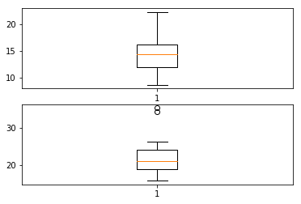
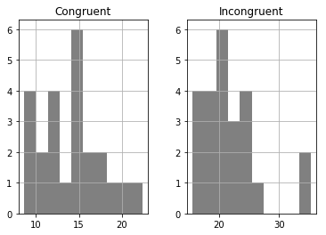

# Stroop Effect Analysis

## Background Information

In a Stroop task, participants are presented with a list of words, with each word displayed in a color of ink. The participant’s task is to say out loud the color of the ink in which the word is printed. The task has two conditions: a congruent words condition, and an incongruent words condition. In the congruent words condition, the words being displayed are color words whose names match the colors in which they are printed: for example RED, BLUE. In the incongruent words condition, the words displayed are color words whose names do not match the colors in which they are printed: for example PURPLE, ORANGE. In each case, we measure the time it takes to name the ink colors in equally-sized lists. Each participant will go through and record a time from each condition.


## Analysis


### 1. What is our independent variable? What is our dependent variable?

The independent variable in this experiment is the conditions being Congruent or Incongruent. The dependent variable is the time it takes for a participant to name the ink color of those words.


### 2. What is an appropriate set of hypotheses for this task? What kind of statistical test do you expect to perform? Justify your choices.

#### Hypothesis

Those hypothesis are about the population. So that we need to test if the population means are different (statistically).

The Null Hypothesis, H0: Time to name colours is the same for congruent and incongruent tasks. Therefore, the null hypothesis states that the mean of congruent population(μ0) is equal to the mean of incongruent population(μ).

The Alternative Hypothesis, H1: Time to name colours is not the same for congruent and incongruent tasks. The alternate hypothesis states that the mean of congruent population(μ0) is not equal to the mean of incongruent population(μ).


H0: μ = μ0 

H1: μ ≠ μ0


#### Testing

In order to test the hypothesis paired t-test would be a good choice since we have two different measurements on the same items which is each participant answered both incongruent and congruent tests so that the samples in this data is dependent. Moreover, the sample dataset does not include much data (< 30) and (according to the visualisations) the distribution is normal which make t-test is appropriate for testing.


### 3. Report some descriptive statistics regarding this dataset. Include at least one measure of central tendency and at least one measure of variability.

Below you can find descriptive statistics regarding this dataset including mean (cenral tendency) and min, max (variablity). 


```python
import pandas as pd
import numpy as np

stroop_test = pd.read_csv("stroopdata.csv")
summary = stroop_test.describe()
summary.transpose()
```


<div>
<table border="1" class="dataframe">
  <thead>
    <tr style="text-align: right;">
      <th></th>
      <th>count</th>
      <th>mean</th>
      <th>std</th>
      <th>min</th>
      <th>25%</th>
      <th>50%</th>
      <th>75%</th>
      <th>max</th>
    </tr>
  </thead>
  <tbody>
    <tr>
      <th>Congruent</th>
      <td>24.0</td>
      <td>14.051125</td>
      <td>3.559358</td>
      <td>8.630</td>
      <td>11.89525</td>
      <td>14.3565</td>
      <td>16.20075</td>
      <td>22.328</td>
    </tr>
    <tr>
      <th>Incongruent</th>
      <td>24.0</td>
      <td>22.015917</td>
      <td>4.797057</td>
      <td>15.687</td>
      <td>18.71675</td>
      <td>21.0175</td>
      <td>24.05150</td>
      <td>35.255</td>
    </tr>
  </tbody>
</table>
</div>


### 4. Provide one or two visualizations that show the distribution of the sample data. Write one or two sentences noting what you observe about the plot or plots.


In first two visualisations below you can see the distribution of the sample data congruent and incongruent respectively. The last two plots are showing the histogram.

Based on those plots, Incongruent observations have outliers having values higher than 30. Both observations are positively skewed. Based on histograms, the distribution seems normal which shows that the real population distribution is close to sample distribution.


```python
%matplotlib inline
import matplotlib.pyplot as plt

fig = plt.figure()

ax1 = fig.add_subplot(211)
ax1.boxplot(stroop_test["Congruent"])

ax2 = fig.add_subplot(212)
ax2.boxplot(stroop_test["Incongruent"])

stroop_test.hist(color="grey")

plt.show()
```








### 5. Now, perform the statistical test and report your results. What is your confidence level and your critical statistic value? Do you reject the null hypothesis or fail to reject it? Come to a conclusion in terms of the experiment task. Did the results match up with your expectations?

When dependent t-test is performed, t statistics value is 8.020706944109957. P-value is 4.1030005857111781e-08 in scientific notation which is close to 0.000000041030005. P-value is less than alpha value (0.005) so that I reject the Null hypothesis. Now it can be said that participants spent less time in Congruent tests with respect to Incongruent ones.


```python
from scipy import stats

stats.ttest_rel(stroop_test["Incongruent"],stroop_test["Congruent"])

```


    Ttest_relResult(statistic=8.020706944109957, pvalue=4.1030005857111781e-08)


### 6. Optional: What do you think is responsible for the effects observed? Can you think of an alternative or similar task that would result in a similar effect? Some research about the problem will be helpful for thinking about these two questions!

There are different thories about stroop effect. The most widely accepted ones are "Processing Speed", "Selective Attention" and "Automaticity". 

Processing speed suggests there is a lag in the brain's ability to recognize the color of the word since the brain reads faster tha it recognize colors.

Selective attention suggests recognition of color requires more attention than reading a word.

Automicity, the most common theory, suggests since recognizing colorsis not an automatic process there is hesitiancy to respond whereas the brain automatically understands the meaning of words as a result of habitual reading.


## References

https://en.wikipedia.org/wiki/Stroop_effect
http://pandas.pydata.org/pandas-docs/stable/
https://matplotlib.org/contents.html

